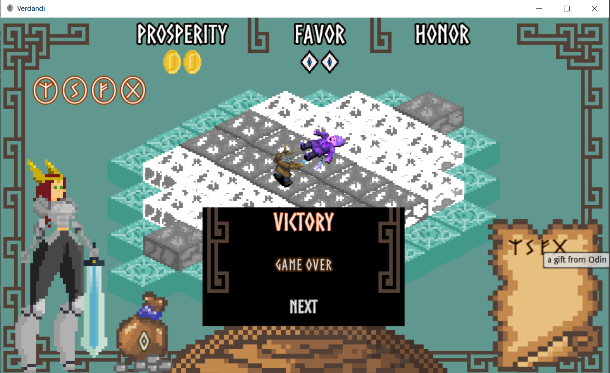
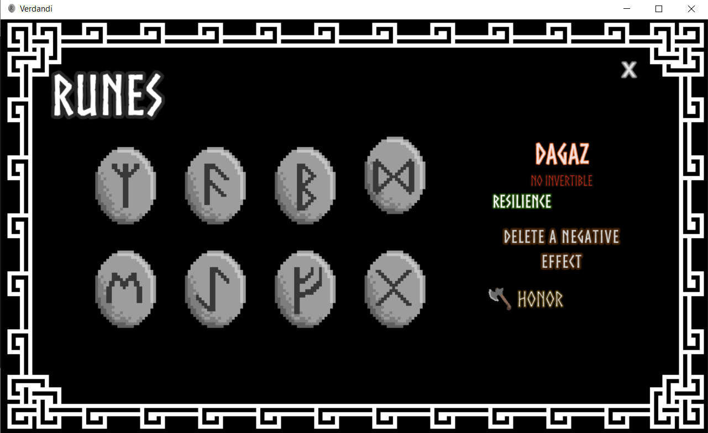

# Verdandi - Leyendas Nórdicas
Proyecto de Videojuego en Godot Engine. Desarrollado en el marco de la cátedra Proyecto Final de la Tecnicatura en Diseño y Programación de Videojuegos en UNLVirtual.

Alumno: Gastón Alberto Caminiti  
Desarrollado con Godot Engine Versión 3.1

### Prototipos 
#### Prototipo 00 (Versión juego de mesa)
[Capturas de elementos de juego](Prototipos/Prototipo00)

#### Prototipo 01 (Videojuego - 1er Nivel)
[Ejecutable](Prototipos/Prototipo01/VerdandiP01.exe)  
[Documentación de Desarrollo](Prototipos/Prototipo01/Documentos/Diario_Desarrollo_VerdandiP01.pdf)

